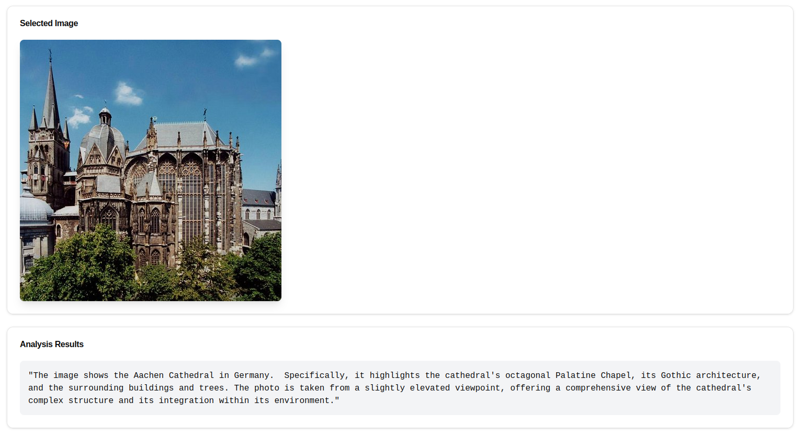

# Object Detection(and image analysis) Frontend


An interface for uploading and analyzing images using different processing modes.

## First, a sample



## Features

- Clean, modern UI built with shadcn/ui components
- Three processing modes:
  - General object detection with visual results
  - AI-powered scene analysis
  - Detailed report generation
- Real-time processing status feedback
- Error handling with user-friendly messages
- Responsive design with Tailwind CSS
- Type-safe implementation with TypeScript

## Getting Started

1. Install dependencies:
```bash
npm install --force
# or
yarn install
```

2. Configure the backend URL in `logic/imageProcessing.ts` (currently set to `http://127.0.0.1:5000`)

3. Start the development server:
```bash
npm run dev
# or
yarn dev
```


### Image Processing Functions
Located in `logic/imageProcessing.ts`:
- `analyzeImage`: Get AI analysis of the image
- `generateImageReport`: Generate detailed scene report
- `detectObjects`: Perform object detection with bounding boxes

## API Integration

The frontend interacts with three backend endpoints:

### 1. Object Detection
```typescript
POST /detect
Content-Type: multipart/form-data
Body: FormData with 'image' field
Response: Blob (processed image)
```

### 2. Analysis
```typescript
POST /analyse
Content-Type: multipart/form-data
Body: FormData with 'file' field
Response: { data: { analysis: string } }
```

### 3. Report Generation
```typescript
POST /report
Content-Type: multipart/form-data
Body: FormData with 'file' field
Response: { data: { report: string } }
```

## UI Components

The application uses the following shadcn/ui components:
- Button
- Input
- Card (with CardHeader, CardContent, CardTitle)
- Custom styling with Tailwind CSS


### Prerequisites
- Node.js 16+
- npm or yarn
- Backend service running (see backend README)


## License

MIT License